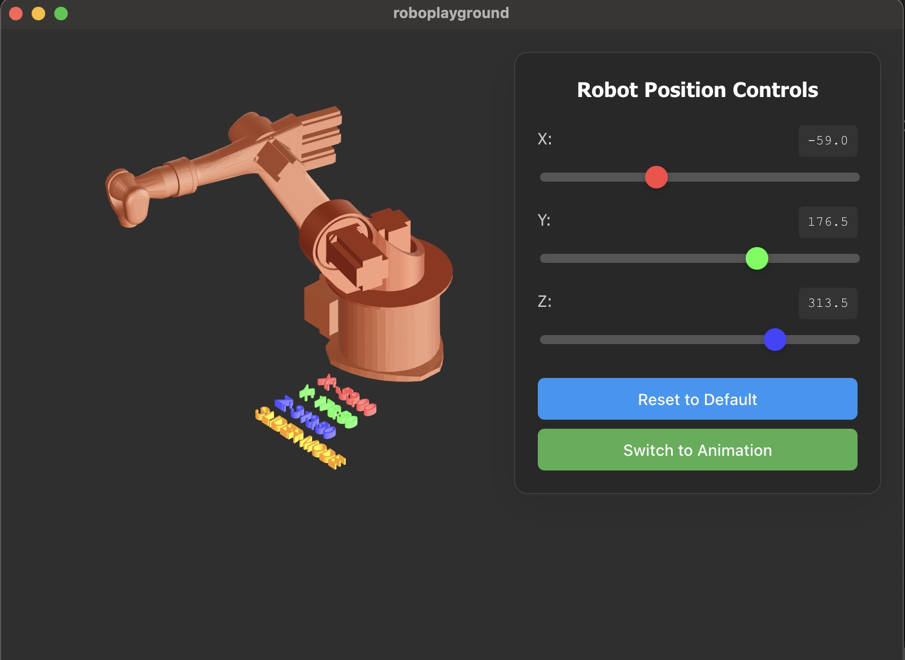

# RoboPlayground 🤖



A 3D interactive playground for experimenting with 6-axis industrial robot kinematics and control. Built with modern web technologies to provide an intuitive interface for understanding robot movement, inverse kinematics, and industrial automation concepts.

  

## 🎯 Features

### 🎮 Interactive Control Modes
- **Animation Mode**: Watch the robot perform smooth, automated figure-8 movements
- **Slider Control**: Manually control the robot's end-effector position with real-time XYZ sliders
- **Seamless Switching**: Toggle between control modes with a single button click

### 🔧 Advanced Robotics
- **Forward Kinematics**: Calculate end-effector position from joint angles
- **Inverse Kinematics**: Compute joint angles from desired end-effector position
- **Real-time Calculations**: Instant response to position changes
- **Workspace Validation**: Automatic handling of unreachable positions

### 🎨 3D Visualization
- **Realistic 3D Models**: High-quality STL robot parts rendering
- **Dynamic Lighting**: Professional HDR environment lighting
- **Interactive Camera**: Orbit controls for exploring the robot from any angle
- **Live Feedback**: Real-time coordinate display and mode indicators

## 🚀 Getting Started

### Prerequisites
- **Node.js** (v18 or higher)
- **Rust** (latest stable version)
- **Git**

### Installation

1. **Clone the repository**
   ```bash
   git clone https://github.com/your-username/RoboPlayground.git
   cd RoboPlayground
   ```

2. **Install dependencies**
   ```bash
   npm install
   ```

3. **Start the development server**
   ```bash
   npm run tauri dev
   ```

The application will open in a new window with the 3D robot simulation ready to use.

## 🎮 How to Use

### Control Modes

#### 🔄 Animation Mode (Default)
- Robot automatically performs smooth figure-8 movements
- Great for demonstrations and understanding robot motion
- No user input required

#### 🎛️ Slider Control Mode
1. Click the **"Switch to Sliders"** button
2. Use the XYZ sliders in the control panel to set target positions:
   - **X Axis**: -200 to 200 (Red slider)
   - **Y Axis**: -100 to 300 (Green slider) 
   - **Z Axis**: 50 to 400 (Blue slider)
3. Watch the robot move to your specified coordinates in real-time
4. Click **"Reset to Default"** to return to home position

### Visual Feedback
- **Coordinate Display**: Live XYZ position of the robot's end-effector
- **Mode Indicator**: Shows current control mode (Animation/Slider)
- **Color Coding**: Red=X, Green=Y, Blue=Z for easy identification

## 🛠️ Technology Stack

### Frontend
- **[Tauri](https://tauri.app/)** - Native desktop application framework
- **[SvelteKit](https://kit.svelte.dev/)** - Modern web framework
- **[Threlte](https://threlte.xyz/)** - Svelte wrapper for Three.js
- **[Three.js](https://threejs.org/)** - 3D graphics library

### Backend/Logic
- **Custom Kinematics Engine** - Forward and inverse kinematics calculations
- **Svelte Stores** - Reactive state management
- **Real-time Updates** - High-performance animation loop

### 3D Assets
- **STL Models** - Industrial robot parts (Base, Axis 1-5)
- **HDR Environment** - Professional lighting setup
- **Material System** - Realistic metal rendering

## 📁 Project Structure

```
RoboPlayground/
├── src/
│   ├── lib/
│   │   ├── kinematics.js      # Robot kinematics calculations
│   │   ├── robotStore.js      # State management
│   │   └── RobotControls.svelte # UI control component
│   ├── routes/
│   │   ├── +page.svelte       # Main application page
│   │   └── Scene.svelte       # 3D robot scene
│   └── app.html               # HTML template
├── static/
│   └── robot/                 # 3D models and assets
├── src-tauri/                 # Rust backend code
└── package.json
```

## 🎓 Learning Opportunities

This project is perfect for:

- **Robotics Students**: Understanding industrial robot kinematics
- **Engineers**: Prototyping robot movements and workspace analysis
- **Developers**: Learning 3D web development with modern frameworks
- **Educators**: Demonstrating robotics concepts interactively

## 🔧 Development

### Available Scripts

```bash
# Start development server
npm run tauri dev

# Build for production
npm run tauri build

# Run tests
npm run check

# Preview production build
npm run preview
```

### Adding New Features

The modular architecture makes it easy to extend:

- **New Control Modes**: Add to `robotStore.js` and update `useTask` in `Scene.svelte`
- **Robot Models**: Replace STL files in `static/robot/` directory
- **Kinematics**: Modify `kinematics.js` for different robot configurations
- **UI Components**: Create new Svelte components in `src/lib/`

## 🤝 Contributing

Contributions are welcome! Feel free to:

- Report bugs and issues
- Suggest new features
- Submit pull requests
- Improve documentation

## 📄 License

This project is licensed under the MIT License - see the [LICENSE](LICENSE) file for details.

## 🙏 Acknowledgments

- Robot kinematics algorithms based on industrial robotics principles
- 3D models designed for educational and demonstration purposes
- Built with love for the robotics and web development communities

## 📞 Support

If you have questions or need help:

1. Check the [Issues](https://github.com/your-username/RoboPlayground/issues) page
2. Create a new issue with detailed information
3. Join our community discussions

---

**Happy Robot Programming! 🤖✨**
